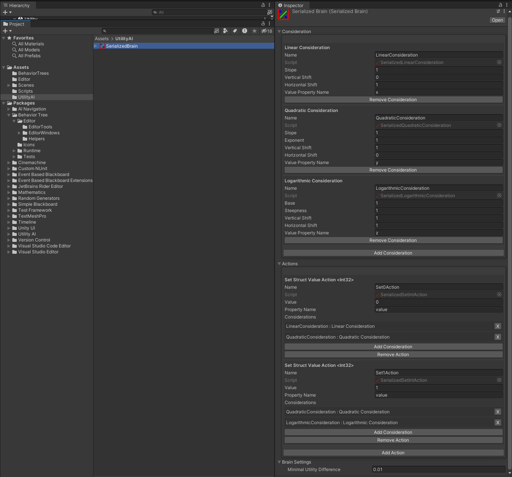
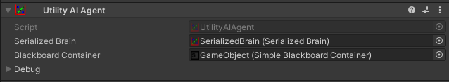
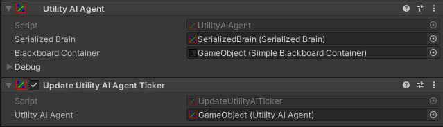
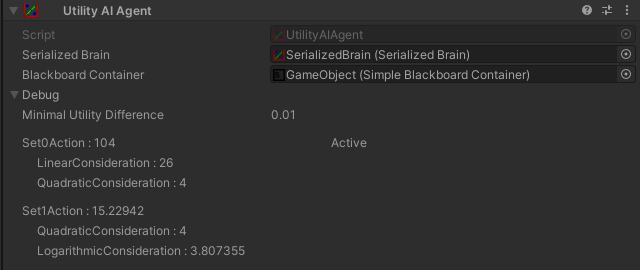

# UtilityAI

Utility AI for Unity is a good solution for choosing an action based on different utility considerations. Usually, it's used for AI.

## Installation

This repo is a regular Unity package. You can install it as your project dependency.
More here: https://docs.unity3d.com/Manual/upm-dependencies.html.

## Usage

### Core types

- [Brain] - main class for Utility AI system.
- [Action] - base class for actions, classes that interact somehow with the world.
- [Consideration] - base class for considerations, classes that compute utilities based on different formulas.

### Setup

#### With regular c# code

[Action] and [Consideration] classes have different create methods. 
Use them to create needed instances of classes.
Next, create [Brain] with its constructor. You should pass arrays of actions and considerations with
binding arrays and other settings.

##### *Example*

```
LinearConsideration linearConsideration = Consideration.Create<LinearConsideration, float, float, float, string>(1f, 0f, 1f, "x");
QuadraticConsideration quadraticConsideration = Consideration.Create<QuadraticConsideration, float, float, float, float, string>(1f, 1f, 1f, 0f, "y");
LogarithmicConsideration logarithmicConsideration = Consideration.Create<LogarithmicConsideration, float, float, float, float, string>(1f, 1f, 1f, 1f, "z");
var considerations = new Consideration[] { linearConsideration, quadraticConsideration, logarithmicConsideration };

SetStructValueAction<int> set0Action = Action.Create<SetStructValueAction<int>, int, string>(0, "value");
SetStructValueAction<int> set1Action = Action.Create<SetStructValueAction<int>, int, string>(1, "value");
var actions = new Action[] { set0Action, set1Action };

int[][] bindings = { new[] { 0, 1 }, new[] { 1, 2 } };

Blackboard blackboard = GetBlackboard();
BrainSettings brainSettings = GetSettings();

var brain = new Brain(considerations, actions, bindings, blackboard, brainSettings);
```

#### With [BrainBuilder]

It may be a little complicated to manage all those arrays and index bindings.
So, that's why there's [BrainBuilder] to help.
Add an action with `AddAction()` method, next add all its considerations with `AddConsideration()` method,
repeat till all the actions with their considerations are added,
and finally call `Build()` to get a [Brain].
If you need to use the same consideration in many actions, add it to all the needed actions - 
[BrainBuilder] can identify equal considerations and actually build only one.

The same [BrainBuilder] may build many times - 
it always creates a new [Brain] with new actions and considerations. 

##### *Example*

```
var builder = new BrainBuilder();

builder.AddAction<SetStructValueAction<int>, int, string>(0, "value");
builder.AddConsideration<LinearConsideration, float, float, float, string>(1f, 0f, 1f, "x");
builder.AddConsideration<QuadraticConsideration, float, float, float, float, string>(1f, 1f, 1f, 0f, "y");

builder.AddAction<SetStructValueAction<int>, int, string>(1, "value");
builder.AddConsideration<QuadraticConsideration, float, float, float, float, string>(1f, 1f, 1f, 0f, "y");
builder.AddConsideration<LogarithmicConsideration, float, float, float, float, string>(1f, 1f, 1f, 1f, "z");

Blackboard blackboard = GetBlackboard();
BrainSettings brainSettings = GetSettings();

Brain brain = builder.Build(blackboard, brainSettings);
```

#### With [SerializedBrain]

The library supports a default Unity serialization based on scriptable objects.
Also, this method provides a custom inspector to create and edit utility AI brains.

To create a serialized utility AI brain,
you need to click `Assets/Create/Utility AI/Serialized Brain` in the Unity interface.
After that, select the created asset and edit it in the inspector.

The type of the serialized behavior tree asset is [SerializedBrain].
Call a method `CreateBrain()` on a valid asset to get a new created utility AI brain.
You can call this method multiple times and get a new identical utility AI brain every time.

##### *Example*



#### With [UtilityAIAgent]

[UtilityAIAgent] is a Unity component that wraps all the logic around [Brain].
You need to add it to any game object and set links to a serialized brain and a blackboard component.

##### *Example*



### [BrainSettings]

The work of a [Brain] may be configured with [BrainSettings]. The settings may be passed as an argument in
a [Brain] constructor or in a method `Build()` of a [BrainBuilder]. The settings are also available in the
interface of a [SerializedBrain].

#### Parameters

- Minimal Utility Difference - utility difference between a new [Action] and current one
required by [Brain] to switch to it.

### Ticks

[Brain] doesn't do anything by itself. You need to call `Brain.Tick()` to make it do something.
But you must call `Brain.Initialize()` before a first tick and `Brain.Dispose()` after a last tick.
If you use a [UtilityAIAgent], you don't have an access to the private [Brain]
and you need to call `UtilityAIAgent.Tick()` or use one of [UtilityAIAgentTickers].
They are Unity components and automatically call `UtilityAIAgent.Tick()` and other methods in different loops.

##### *Example*



### Customization

You can add your custom actions and considerations.
You need to inherit [Action] or [Consideration] accordingly.
You mustn't add a constructor to your custom behavior. They must have only a default constructor.
To get a constructor functionality, implement an [ISetupable] interface.
After that you already can use your behavior in code.
But to serialize it, you need to inherit [SerializedAction] or [SerializedConsideration] accordingly.

#### [DrawingAttributes]

- [NameOverrideAttribute] - add it to a serialized behavior class and set a name of a setup argument. 
For every argument you need to add an instance of the attribute.
If a serialized argument doesn't have such an attribute, it's drawn with a generic name.

### Debug

#### [BrainDebugInfo]

[BrainDebugInfo] is a class that represent a state of a [Brain]. It may be filled with info with a method
`Brain.FillDebugInfo()`.

#### [UtilityAIAgent] Debug

Editor of a [UtilityAIAgent] uses [BrainDebugInfo] and draws that information in the inspector.



#### Logs

This library automatically logs different messages via Unity log. You can control it with defines from [UtilityAIDebug]:
UTILITY_AI_LOG, UTILITY_AI_WARNING and UTILITY_AI_ERROR.

[Brain]: Runtime/Core/Brain.cs
[Action]: Runtime/Core/Action.cs
[Consideration]: Runtime/Core/Consideration.cs
[BrainBuilder]: Runtime/Builder/BrainBuilder.cs
[SerializedBrain]: Runtime/Serialization/SerializedBrain.cs
[UtilityAIAgent]: Runtime/Components/UtilityAIAgent.cs
[BrainSettings]: Runtime/Core/BrainSettings.cs
[UtilityAIAgentTickers]: Runtime/Components/UtilityAIAgentTickers
[ISetupable]: Runtime/Core/ISetupable.cs
[SerializedAction]: Runtime/Serialization/SerializedActions/SerializedAction.cs
[SerializedConsideration]: Runtime/Serialization/SerializedConsiderations/SerializedConsideration.cs
[DrawingAttributes]: Runtime/DrawingAttributes
[NameOverrideAttribute]: Runtime/DrawingAttributes/NameOverrideAttribute.cs
[BrainDebugInfo]: Runtime/Debug/BrainDebugInfo.cs
[UtilityAIDebug]: Runtime/Debug/UtilityAIDebug.cs
